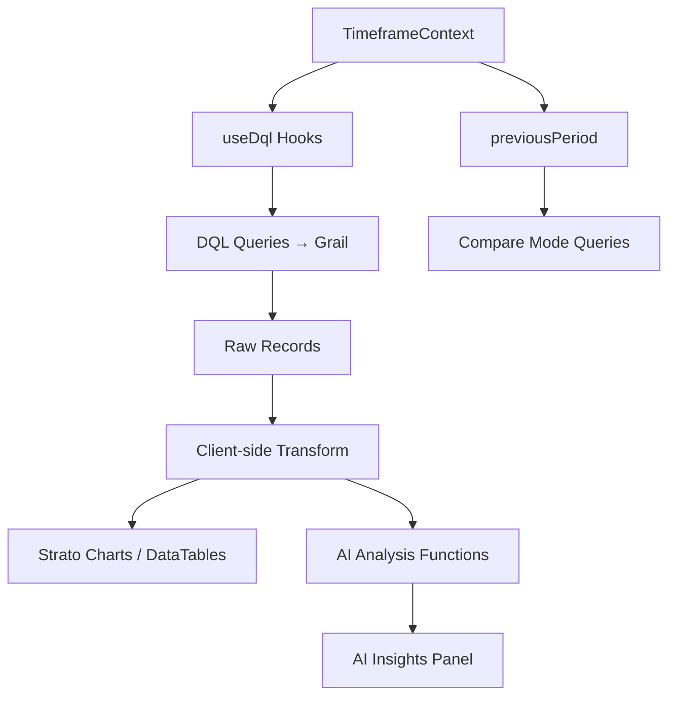

# Services Overview App — Design Document

---

## Non-Strato Dependencies

This section catalogs every library and SDK that is **not** part of `@dynatrace/strato-components` or `@dynatrace/strato-components-preview`, documenting what it provides and exactly where it is used in the codebase.

### React Core

| Package | Version | What it provides |
|---------|---------|-----------------|
| `react` | ^18.3.1 | JSX runtime, all hooks (`useState`, `useMemo`, `useCallback`, `useEffect`, `useRef`, `useContext`, `createContext`) |
| `react-dom` | ^18.3.1 | DOM renderer and `createPortal` |

**`react`** is imported in every `.tsx` file in the project.

**`react-dom`** is used in two distinct roles:
- `react-dom/client` → `ReactDOM.createRoot()` in **`ui/main.tsx`** — bootstraps the React tree into the DOM.
- `createPortal()` in all nine graph/topology components — renders SVG tooltip overlays outside the component's DOM subtree so they are not clipped by `overflow: hidden` containers:
  - `ui/app/components/ServiceTopology.tsx`
  - `ui/app/components/BlastRadiusGraph.tsx`
  - `ui/app/components/HostBlastRadiusGraph.tsx`
  - `ui/app/components/K8sWorkloadBlastRadiusGraph.tsx`
  - `ui/app/components/K8sClusterBlastRadiusGraph.tsx`
  - `ui/app/components/K8sNodeBlastRadiusGraph.tsx`
  - `ui/app/components/K8sNamespaceBlastRadiusGraph.tsx`
  - `ui/app/components/K8sPodBlastRadiusGraph.tsx`
  - `ui/app/components/K8sContainerBlastRadiusGraph.tsx`

> **Note:** All graph and topology components draw exclusively with raw SVG and inline React state — no D3 library is imported anywhere. The architecture comment in `main.tsx` referencing "D3 force-directed" is inaccurate.

---

### Routing

| Package | Version | What it provides |
|---------|---------|-----------------|
| `react-router-dom` | ^6.22.2 | `BrowserRouter`, `Routes`, `Route`, `Link` |

Used in two files:
- **`ui/main.tsx`** — `BrowserRouter` wraps the entire app to provide routing context.
- **`ui/app/App.tsx`** — `Routes` / `Route` define the single `/` route that renders `ServicesOverview`.

---

### Dynatrace SDK (Non-Strato)

These packages are part of the Dynatrace App Platform SDK. They provide access to platform APIs that Strato does not expose.

#### `@dynatrace-sdk/app-environment` (^1.1.4)

Provides `getEnvironmentUrl()` — returns the base URL of the connected Dynatrace environment (e.g. `https://guu84124.apps.dynatrace.com`).

Used to construct deep-link URLs into Dynatrace platform apps scoped to the current timeframe and entity:
- **`ui/app/pages/ServicesOverview.tsx`** — builds drill-through URLs for Distributed Tracing, Davis Problems, and SLO apps throughout the Overview, Anomaly Detection, and other tabs.
- **`ui/app/components/ServiceTopology.tsx`** — entity drill-through links on node click.
- **All eight Blast Radius graph components** (`BlastRadiusGraph.tsx`, `HostBlastRadiusGraph.tsx`, `K8s*BlastRadiusGraph.tsx`) — entity drill-through links when a node is selected.

#### `@dynatrace-sdk/react-hooks` (^1.6.0)

Provides three hooks used extensively throughout the app:

| Hook | Purpose | Used in |
|------|---------|---------|
| `useDql` | Declarative DQL query execution with automatic polling, caching, and error handling | `ServicesOverview.tsx` — every data-fetching query across all 28 tabs |
| `useUserAppState` | Reads a named key from the user's persistent app state | `ServicesOverview.tsx` (tab visibility, tab order, KPI selections, alert rules, runbook links), `AnnotationLayer.tsx` (annotation storage) |
| `useSetUserAppState` | Writes a named key to the user's persistent app state | `ServicesOverview.tsx`, `AnnotationLayer.tsx` |

#### `@dynatrace-sdk/client-document` (^1.30.0)

Provides `documentsClient` — the Dynatrace Documents API client for creating and managing Notebooks.

Used in **`ui/app/pages/ServicesOverview.tsx`** in the **Reliability Report** tab: the "Generate Reliability Report" button calls `documentsClient.createDocument()` to export a formatted Notebook containing fleet reliability metrics, SLO status, incident analysis, and executive summary.

---

### Unused Dependencies (listed in package.json but not imported)

The following packages appear in `package.json` but are not imported anywhere in the source code. They are safe to remove if bundle size becomes a concern.

| Package | Version | Notes |
|---------|---------|-------|
| `react-intl` | 6.6.2 | Internationalization library — never imported. No `IntlProvider`, `FormattedMessage`, or `useIntl` calls exist in the codebase. |
| `@dynatrace-sdk/navigation` | ^2.2.0 | Cross-app navigation SDK — not imported. |
| `@dynatrace-sdk/error-handlers` | ^1.3.1 | SDK error handler utilities — not imported. Error recovery is handled via a custom `ErrorBoundary` in `App.tsx`. |
| `@dynatrace-sdk/user-preferences` | ^1.1.3 | User preferences API — not imported. Preference persistence uses `useUserAppState` instead. |
| `@dynatrace-sdk/client-query` | ^1.21.2 | Direct DQL query client — not imported directly. Used transitively by `@dynatrace-sdk/react-hooks` as the underlying query engine for `useDql`. |

---


The **Services Overview App** is a Dynatrace platform application that provides a comprehensive, multi-tab SRE command center for monitoring, analyzing, and managing service reliability across an entire fleet. It aggregates RED metrics (Rate, Errors, Duration), Kubernetes workload health, dependency topology, SLO error budgets, anomaly detection, blast radius simulation, and capacity planning into a single unified interface.

### Architecture

```
ui/
├── main.tsx                          # Entry point (IntlProvider + AppRoot)
├── app/
│   ├── App.tsx                       # Root component (ErrorBoundary + TimeframeProvider + Page + Router)
│   ├── queries.ts                    # All DQL query builder functions
│   ├── components/
│   │   ├── Header.tsx                # App navigation link (shell chrome)
│   │   ├── ServiceTopology.tsx       # D3 force-directed dependency graph
│   │   ├── BlastRadiusGraph.tsx      # Service-mode blast radius graph
│   │   ├── HostBlastRadiusGraph.tsx  # Host-mode blast radius graph
│   │   ├── K8sWorkloadBlastRadiusGraph.tsx
│   │   ├── K8sClusterBlastRadiusGraph.tsx
│   │   ├── K8sNodeBlastRadiusGraph.tsx
│   │   ├── K8sNamespaceBlastRadiusGraph.tsx
│   │   ├── K8sPodBlastRadiusGraph.tsx
│   │   └── K8sContainerBlastRadiusGraph.tsx
│   ├── pages/
│   │   ├── ServicesOverview.tsx       # Main page with all tab logic
│   │   └── ServicesOverview.css       # Styling
│   └── state/
│       └── TimeframeContext.tsx       # Global timeframe state + DQL helpers
```

### Key Design Patterns

- **Timeframe Context**: All time-windowed queries use a shared `TimeframeContext` that provides `from`/`to` values (expressions like `now()-7d` or ISO timestamps). The `tfClause(tf)` helper renders inline `from:..., to:...` DQL syntax.
- **Previous Period Comparison**: `previousPeriod(tf)` computes a TF of equal length ending where the current period starts. Used by Compare mode.
- **Lazy Query Execution**: Tabs that are not active use `NOOP_QUERY` (`fetch logs | limit 0`) to avoid unnecessary DQL execution.
- **useDql Hook**: All queries use `@dynatrace-sdk/react-hooks`'s `useDql` for declarative data fetching with automatic polling.
- **User App State**: Tab visibility, tab order, KPI selections, and runbook links are persisted via `useUserAppState` / `useSetUserAppState`.
- **ErrorBoundary**: Auto-recovers from `QUERY_GONE` errors (stale DQL tokens when the browser tab was backgrounded).

---

## Global Controls

### Header Bar
A single unified header bar (matching the User Journey & Experience app layout) with the app name on the left and all controls on the right:
- **App Title**: "Services Overview" displayed as a heading on the left.
- **Timeframe**: Labeled selector sets the global timeframe for all queries (default: last 7 days).
- **Metric-Stream**: Labeled auto-refresh interval selector (Off, 30s, 1m, 5m, 10m) for near-real-time monitoring. Shows a spinner + "Xs ago" timestamp when active.
- **AI Insights**: Toggle button to open/close the AI analysis panel for the active tab.
- **Help**: Opens the help modal with feature documentation.
- **Settings Modal**: Configures `topN` (max services, default 1000), `chartTopN` (chart series limit, default 10), and `problemsLookbackHours` (default 7h). Also includes Tab Visibility Manager (toggle tabs on/off, drag-to-reorder, persisted in user app state).
- **Version**: Displays the current app version.
- **Compare Mode**: (Contextual) Appears on supported tabs to overlay previous-period data on Service Metrics, Process Metrics, K8s Workloads, Scorecards, and Apdex tabs.

### Configurable Parameters
| Parameter | Default | Description |
|-----------|---------|-------------|
| `topN` | 1000 | Max records for detail tables |
| `chartTopN` | 10 | Max series for timeseries charts |
| `problemsLookbackHours` | 7 | Hours to look back for active problems |
| `sloTarget` | 99.9% | SLO target for error budget calculations |
| `apdexT` | 500ms | Apdex satisfied threshold |

---

## Tab: Overview

### Purpose
Primary command center showing fleet-wide health at a glance. Includes:
1. **Executive Summary KPI Bar** — Configurable widgets (up to 5) showing total requests, error rate, active problems, affected services, SLO breaches.
2. **Services Health Honeycomb** — Color-coded heatmap of all services (green = healthy, red = problem).
3. **Top 3 Risks Right Now** — Combines Davis anomalies + active problems + SLO burn rates.
4. **Problems Table** — Full list of Davis problems with affected entities, duration, root cause.

### DQL Queries

#### Services Health Honeycomb
```dql
fetch dt.entity.service
| filter serviceType != "DATABASE_SERVICE"
| lookup [
  fetch dt.davis.problems, from:now()-{problemsLookbackHours}h, to:now()
  | filter event.status == "ACTIVE"
  | expand affected_entity_ids
], sourceField:id, lookupField:affected_entity_ids
| fieldsAdd affected = if(isNotNull(lookup.affected_entity_ids), "Problem", else: "Healthy")
| fields affected, id, entity.name
| sort affected desc
```

**Logic**: Fetches all non-database services, joins with active Davis problems via `affected_entity_ids`, and tags each service as "Problem" or "Healthy".

#### Problems List
```dql
fetch dt.davis.problems
| filter `dt.davis.is_duplicate` == false
| sort timestamp desc
| expand affected_entity_ids
| lookup [fetch dt.entity.service], sourceField:affected_entity_ids, lookupField: id, prefix:"lookup.affected.entity.services"
| lookup [fetch dt.entity.process_group_instance], sourceField:affected_entity_ids, lookupField: id, prefix:"lookup.affected.entity.pgi"
| lookup [fetch dt.entity.host], sourceField:affected_entity_ids, lookupField: id, prefix:"lookup.affected.entity.hosts"
| lookup [fetch dt.entity.cloud_application], sourceField:affected_entity_ids, lookupField: id, prefix:"lookup.affected.entity.cloudapplication"
| lookup [fetch dt.entity.kubernetes_cluster], sourceField:affected_entity_ids, lookupField: id, prefix:"lookup.affected.entity.kubernetescluster"
| summarize {
    startTime = takeFirst(event.start),
    endTime = takeFirst(event.end),
    problemClosedDuration = takeFirst(resolved_problem_duration),
    status = takeFirst(event.status),
    event.name = takeFirst(event.name),
    severityLevel = takeFirst(event.category),
    rootCause = takeFirst(root_cause_entity_name),
    affectedServices = collectDistinct(lookup.affected.entity.servicesentity.name),
    affectedPGI = collectDistinct(lookup.affected.entity.pgientity.name),
    affectedHosts = collectDistinct(lookup.affected.entity.hostsentity.name),
    affectedCloudApplication = collectDistinct(lookup.affected.entity.cloudapplicationentity.name),
    affectedKubernetesCluster = collectDistinct(lookup.affected.entity.kubernetesclusterentity.name),
    event.id = takeFirst(event.id)
  }, by:{display_id, event.kind}
| fieldsAdd currentTime = toTimestamp(now())
| fieldsAdd Description = concat(display_id, " - ", event.name)
| fields Status, Description, Affected, RootCause, StartTime, EndTime, Duration, event.id, event.kind
| sort StartTime descending, Status ascending
```

**Logic**: Fetches all non-duplicate problems, expands affected entities, performs 5 lookups to resolve entity names (services, PGIs, hosts, cloud apps, K8s clusters), then summarizes per problem with duration calculation (closed → `resolved_problem_duration`, active → `now() - event.start`).

---

## Tab: Service Details

### Purpose
Definitive RED metrics table for all services. Shows per-service: Status, Requests, Latency (Avg/P50/P90/P99), Failure Rate, 5xx, 4xx, and active problem count. Includes team ownership (dt.owner tag), runbook links, and recent deployment events inline.

### DQL Query
```dql
timeseries {
  latency_p50 = median(dt.service.request.response_time),
  latency_p90 = percentile(dt.service.request.response_time, 90),
  latency_p99 = percentile(dt.service.request.response_time, 99),
  requests = sum(dt.service.request.count),
  errors = sum(dt.service.request.failure_count)
}, by:{dt.entity.service}, from:..., to:...

| lookup [timeseries latency_avg = avg(dt.service.request.response_time), by:{dt.entity.service}, ...]
| lookup [timeseries http_5xx = sum(dt.service.request.count, default:0.0), filter:(http.response.status_code >= 500 and <= 599)]
| lookup [timeseries http_4xx = sum(dt.service.request.count, default:0.0), filter:(http.response.status_code >= 400 and <= 499)]
| lookup [fetch dt.davis.problems | filter event.status == "ACTIVE" and dt.davis.is_duplicate == false | expand affected_entity_ids | summarize ...]

| fieldsAdd Latency_Avg, Latency_p50, Latency_p90, Latency_p99, Requests, Failures, 5xx, 4xx, FailureRate
| fieldsAdd Service = entityName(dt.entity.service)
| fields Status, Service, dt.entity.service, Requests, Latency_Avg, ..., event.id
| sort StatusSort asc
| limit {topN}
```

**Logic**: Computes timeseries aggregates per service, then joins 4 lookups (avg latency, 5xx, 4xx, active problems). Services with active problems sort to top. Status is "PROBLEM" if the service has any active Davis problem.

#### Service Ownership
```dql
fetch dt.entity.service
| filter serviceType != "DATABASE_SERVICE"
| fields id, entity.name, owner = tags[dt.owner]
| filter isNotNull(owner)
| limit 5000
```

---

## Tab: Request Details

### Purpose
Per-endpoint performance data from distributed traces. Shows endpoint name, service, requests, latency percentiles, failure rate, 5xx/4xx breakdown, and P99 anomaly detection vs baseline.

### DQL Query
```dql
fetch spans, samplingRatio:1, scanLimitGBytes:50, from:..., to:...
| filter request.is_root_span == true AND isNotNull(endpoint.name)
| fieldsAdd sampling.probability = (power(2, 56) - coalesce(sampling.threshold, 0)) * power(2, -56),
            sampling.multiplicity = 1/sampling.probability,
            multiplicity = coalesce(sampling.multiplicity, 1) * coalesce(aggregation.count, 1) * dt.system.sampling_ratio
| fieldsAdd request.status_code = if(request.is_failed, "Failure", else:"Success")
| fieldsAdd aggregation.duration_avg = coalesce(aggregation.duration_sum/aggregation.count, duration)
| summarize {
    Latency_Avg = sum(aggregation.duration_avg * multiplicity) / sum(multiplicity),
    Latency_p50 = percentile(duration, 50),
    Latency_p90 = percentile(duration, 90),
    Latency_p99 = percentile(duration, 99),
    Requests = sum(multiplicity),
    Failures = sum(if(request.status_code == "Failure", multiplicity, else:0)),
    5xx = sum(if(http.response.status_code >= 500 and <= 599, multiplicity, else:0)),
    4xx = sum(if(http.response.status_code >= 400 and <= 499, multiplicity, else:0))
  }, by:{dt.entity.service.entity.name, endpoint.name, dt.system.sampling_ratio}
| fields Service, Request, Requests, Latency_Avg, Latency_p50, Latency_p90, Latency_p99, FailureRate, Failures, 5xx, 4xx
| sort Requests desc
| limit {topN}
```

**Logic**: Fetches root spans, applies sampling multiplicity correction (accounts for Dynatrace adaptive sampling), then summarizes per endpoint with weighted averages. The multiplicity calculation ensures accurate request counts even at high sampling ratios.

#### P99 Anomaly Baseline (previous period)
```dql
fetch spans, samplingRatio:1, scanLimitGBytes:50, {previous period}
| filter request.is_root_span == true AND isNotNull(endpoint.name)
| summarize { Latency_p99 = percentile(duration, 99) }, by:{dt.entity.service, endpoint.name}
```

**Logic**: Computes previous-period P99 per endpoint. Current P99 is compared against this baseline — >20% deviation = yellow badge, >50% = red badge.

#### Error Category Breakdown
```dql
fetch spans | filter request.is_root_span == true AND request.is_failed == true
| fieldsAdd error_category = if(status_code >= 500, "5xx", else: if(>= 400, "4xx", else: if(duration >= 30s, "timeout", else: "other")))
| summarize { count = sum(multiplicity) }, by:{dt.entity.service, endpoint.name, error_category}
```

---

## Tab: Service Metrics

### Purpose
Time-series charts for the top N services across 8 dimensions. Includes Percentile Comparison mode, 7-Day Forecast, and Anomaly Deviation Shading.

### Sub-charts & DQL

| Chart | Metric | DQL |
|-------|--------|-----|
| Requests Total | `sum(dt.service.request.count)` | `timeseries requests = sum(dt.service.request.count), by:{dt.entity.service}` |
| Latency P50 | `percentile(dt.service.request.response_time, 50)` | `timeseries latency_p50 = percentile(..., 50), by:{dt.entity.service}` |
| Latency P90 | `percentile(dt.service.request.response_time, 90)` | `timeseries latency_p90 = percentile(..., 90), by:{dt.entity.service}` |
| Latency P75 | `percentile(dt.service.request.response_time, 75)` | `timeseries latency_p75 = percentile(..., 75), by:{dt.entity.service}` |
| Latency P99 | `percentile(dt.service.request.response_time, 99)` | `timeseries latency_p99 = percentile(..., 99), by:{dt.entity.service}` |
| Failed Requests | `sum(dt.service.request.failure_count)` | `timeseries errors = sum(dt.service.request.failure_count, default:0), by:{dt.entity.service}` |
| Failure Rate % | Computed | `timeseries total = sum(request.count) \| lookup errors \| failureRate = errors/total*100` |
| HTTP 5xx | `sum(dt.service.request.count)` filtered | `filter: http.response.status_code >= 500 and <= 599` |
| HTTP 4xx | `sum(dt.service.request.count)` filtered | `filter: http.response.status_code >= 400 and <= 499` |
| By Status Code | `sum(dt.service.request.count)` | `timeseries by:{http.response.status_code}` |

All timeseries queries are sorted by `arrayAvg(metric) desc` and limited to `chartTopN`.

#### Deployment Events (overlay)
```dql
fetch events, from:..., to:...
| filter event.type == "CUSTOM_DEPLOYMENT"
| fieldsAdd serviceName = entityName(dt.entity.service)
| fields timestamp, event.name, serviceName, dt.entity.service, event.type
| sort timestamp desc | limit 200
```

#### Compare Mode
Each metric has a `*PrevQuery` variant that re-runs the same DQL against `previousPeriod(tf)`. Shown as side-by-side or overlay charts.

---

## Tab: Process Metrics

### Purpose
Infrastructure-level resource consumption per process group instance. Includes process restart detection and memory leak indicators.

### Sub-charts & DQL

| Chart | Metric | DQL |
|-------|--------|-----|
| CPU Usage | `avg(dt.process.cpu.usage)` | `timeseries cpu = avg(dt.process.cpu.usage), by:{dt.entity.process_group_instance, dt.entity.host}` |
| Memory % | `avg(dt.process.memory.usage)` | `timeseries memory = avg(dt.process.memory.usage), by:{...}` |
| Memory Used (bytes) | `avg(dt.process.memory.working_set_size)` | `timeseries memory = avg(dt.process.memory.working_set_size), by:{...}` |
| GC Suspension Time | Multi-runtime | Appends JVM + CLR + Go + Node.js GC metrics via `append []` |

#### GC Suspension (multi-runtime)
```dql
timeseries gc_time = avg(dt.runtime.jvm.gc.suspension_time), by:{pgi, host}
| append [timeseries gc_time = avg(dt.runtime.clr.gc.suspension_time), ...]
| append [timeseries gc_time = avg(dt.runtime.go.gc.suspension_time), ...]
| append [timeseries gc_time = avg(dt.runtime.nodejs.gc.suspension_time), ...]
```

#### Process Restart Events
```dql
fetch events, from:..., to:...
| filter event.kind == "DAVIS_EVENT" AND event.type == "PROCESS_RESTART"
| fields timestamp, event.name, pgi = entityName(dt.entity.process_group_instance), host = entityName(dt.entity.host)
| sort timestamp desc | limit 200
```

---

## Tab: K8s Workloads

### Purpose
Container-level CPU and memory for Kubernetes workloads vs configured limits. Includes Node Resource Pressure, Pod Eviction/OOMKill stream, HPA Scaling Events, and Namespace Rollup.

### Sub-charts & DQL

| Chart | Metric | DQL |
|-------|--------|-----|
| CPU Usage | `avg(dt.kubernetes.container.cpu_usage)` | `timeseries cpu, limits = avg(dt.kubernetes.container.limits_cpu), by:{workload, namespace, cluster}` |
| Memory Usage | `avg(dt.kubernetes.container.memory_working_set)` | `timeseries memory, limits = avg(dt.kubernetes.container.limits_memory), by:{...}` |

#### Node Resource Pressure
```dql
timeseries { cpu, cpu_limits, memory, memory_limits }, by:{k8s.node.name}
| fieldsAdd cpu_pct = avg_cpu / avg_cpu_limit * 100, memory_pct = avg_memory / avg_memory_limit * 100
| fields node, cpu_pct, memory_pct
| sort cpu_pct desc | limit 50
```

Nodes with cpu_pct or memory_pct > 85% are flagged as PRESSURE.

#### Pod Eviction & OOMKill Events
```dql
fetch events, from:..., to:...
| filter event.kind == "K8S_EVENT" AND (matchesPhrase(content, "OOMKilled") OR matchesPhrase(content, "Evicted") OR event.type == "POD_EVICTION")
| fields timestamp, content, workload, namespace, k8s.pod.name
| sort timestamp desc | limit 200
```

#### HPA Scaling Events
```dql
fetch events, from:..., to:...
| filter event.kind == "K8S_EVENT" AND matchesPhrase(content, "scaled")
| fields timestamp, content, workload, namespace
| sort timestamp desc | limit 100
```

#### Namespace Rollup
```dql
timeseries { cpu, memory }, by:{k8s.namespace.name}
| fieldsAdd avg_cpu = arrayAvg(cpu), avg_memory = arrayAvg(memory)
| fields k8s.namespace.name, avg_cpu, avg_memory | sort avg_cpu desc
```

---

## Tab: SLO & Error Budget

### Purpose
Multi-window burn rate analysis per service (Google SRE method). Shows 1h/6h/24h/72h burn rates with status (OK/WARNING/EXHAUSTED).

### DQL — Multi-Window Burn Rate
```dql
timeseries {
  requests = sum(dt.service.request.count),
  errors = sum(dt.service.request.failure_count)
}, by:{dt.entity.service}, from:now()-{windowHours}h, to:now()
| fieldsAdd Service = entityName(dt.entity.service),
            totalReqs = arraySum(requests), totalErrs = arraySum(errors)
| fieldsAdd errorRate = (totalErrs / totalReqs) * 100
| fields Service, dt.entity.service, errorRate, totalReqs
| filter totalReqs > 0 | sort errorRate desc | limit 200
```

**Logic**: Runs for each window (1h, 6h, 24h, 72h). Burn rate = (error rate / (100 - SLO target)). Alerting thresholds per Google SRE: 1h > 14.4× = page, 6h > 6× = ticket, 72h > 1× = depleting.

### Client-Side Computation
- **Error Budget Remaining %** = `max(0, (1 - (errorRate / errorBudget)) * 100)` where `errorBudget = 100 - sloTarget`
- **Status**: EXHAUSTED (remaining ≤ 0), WARNING (remaining < 20%), OK
- **SLO Composite Groups**: Groups of services tracked as a unit — all must pass for the group to pass.

---

## Tab: Scorecards

### Purpose
Composite health scores for each service with letter grades (A-F) and color coding. Team Leaderboard ranks services for benchmarking.

### Scoring Formula (client-side)
```
Score = 100
       - (FailureRate penalty)      // 35% weight: 0-1% = 0, 1-5% = 15-35, >5% = 35
       - (Latency penalty)          // 20% weight: based on P90/P50 ratio
       - (Problem penalty)          // 25% weight: active problem = -25
       - (5xx penalty)              // 20% weight: proportional to 5xx / Requests
```

**Grades**: A (≥90), B (80-89), C (70-79), D (60-69), F (<60)

### DQL — Previous Period (for comparison)
```dql
timeseries { latency_p50, latency_p90, requests, errors }, by:{dt.entity.service}, {previous period}
| lookup [timeseries http_5xx ...]
| fieldsAdd Latency_p50, Latency_p90, Requests, Failures, 5xx, FailureRate
| fields Service, dt.entity.service, Requests, Latency_p50, Latency_p90, FailureRate, 5xx
| limit {topN}
```

---

## Tab: Dependencies

### Purpose
Interactive force-directed topology graph showing service-to-service call relationships with latency heat coloring on edges.

### DQL
```dql
fetch dt.entity.service
| filter serviceType != "DATABASE_SERVICE"
| fieldsAdd calledServices = calls[`dt.entity.service`]
| filter isNotNull(calledServices)
| expand calledServices
| fieldsAdd Caller = entity.name, CallerId = id,
            Callee = entityName(calledServices, type:"dt.entity.service"), CalleeId = toString(calledServices)
| filter isNotNull(Callee)
| fields Caller, CallerId, Callee, CalleeId
| sort Caller asc
```

**Logic**: Uses the `calls[]` relationship on service entities to extract the dependency graph. Rendered as a D3 force-directed graph with:
- **Latency Heat Coloring**: Edge color based on P90/P50 ratio — green (≤2×), yellow (2-3×), red (>3×)
- **Hide Healthy Toggle**: Shows only degraded edges during incidents
- **Change Impact Overlay**: Highlights edges that changed post-deployment

---

## Tab: Endpoint Heatmap

### Purpose
Hourly heatmap grid showing per-service metric intensity. Supports P50/P90/P99/Error Rate toggle and 2σ anomaly detection.

### DQL — Current Period (hourly)
```dql
timeseries {
  requests = sum(dt.service.request.count),
  errors = sum(dt.service.request.failure_count),
  latencyP50 = median(dt.service.request.response_time),
  latencyP90 = percentile(dt.service.request.response_time, 90),
  latencyP99 = percentile(dt.service.request.response_time, 99)
}, by:{dt.entity.service}, interval:1h, from:..., to:...
| fieldsAdd Service = entityName(dt.entity.service)
| limit 5000
```

### DQL — Previous Week Baseline (for anomaly detection)
```dql
timeseries { requests, errors, latencyP50, latencyP90, latencyP99 },
  by:{dt.entity.service}, interval:1h, from:now()-14d, to:now()-7d
```

**Logic**: Client-side computes mean and standard deviation from the previous week baseline. Cells deviating >2σ from the baseline mean are flagged as anomalies.

---

## Tab: MTTR / MTTA

### Purpose
Mean Time to Resolve analysis across closed problems. Includes environment benchmark, trend forecast, and repeat offender tracking.

### DQL — Closed Problems
```dql
fetch dt.davis.problems, from:..., to:...
| filter dt.davis.is_duplicate == false AND event.status == "CLOSED"
| fields display_id, event.id, event.name, event.start, event.end, resolved_problem_duration, management_zones, root_cause_entity_name
| fieldsAdd duration_minutes = toDouble(resolved_problem_duration) / 60000000000.0
| sort event.start desc | limit 500
```

### DQL — Environment-Wide Benchmark (30-day)
```dql
fetch dt.davis.problems, from:now()-30d, to:now()
| filter event.status == "CLOSED"
| fields dt.entity.service, duration_minutes = (event.end - event.start) / 60000000000, ...
| limit 1000
```

### DQL — Repeat Offenders
```dql
fetch dt.davis.problems, from:now()-30d, to:now()
| filter event.status == "CLOSED"
| filter isNotNull(root_cause_entity_name) AND root_cause_entity_name != ""
| summarize occurrences = count(), avgDuration = avg(duration_minutes), by:{root_cause_entity_name}
| filter occurrences >= 2
| sort occurrences desc | limit 10
```

**Logic**: MTTR = average `duration_minutes` across closed problems. Benchmark percentile = rank of current MTTR against all env-wide resolved problems. Forecast = linear trend of MTTR over time projected to target.

---

## Tab: Anomaly Detection

### Purpose
Compares current-period metrics against a baseline period to detect services operating outside normal bounds. Includes correlation panel and suppression rules.

### DQL
```dql
timeseries {
  requests = sum(dt.service.request.count),
  errors = sum(dt.service.request.failure_count),
  latency_p90 = percentile(dt.service.request.response_time, 90)
}, by:{dt.entity.service}, from:..., to:...
| fieldsAdd Service = entityName(dt.entity.service)
| fieldsAdd avgRequests = arrayAvg(requests), totalErrors = arraySum(errors), totalRequests = arraySum(requests)
| fieldsAdd avgLatencyP90 = arrayAvg(latency_p90)
| fieldsAdd errorRate = totalErrors / totalRequests * 100
| fields Service, dt.entity.service, avgRequests, totalErrors, totalRequests, avgLatencyP90, errorRate
```

**Logic**: Runs identical query for both current and baseline (previous) periods. Client-side computes % change in latency and error rate. Anomaly = latency change >30% OR error rate change >2 percentage points. Correlation detection groups services with co-occurring anomalies.

---

## Tab: Incident Timeline

### Purpose
Merged chronological view of problems and deployments for correlating incidents with changes. Includes inline annotations, team assignment, and root-cause grouping.

### Data Sources
- **Problems**: Same `problemsQuery()` data (already fetched for Overview tab)
- **Deployments**: Same `deploymentEventsQuery()` data

**Logic**: Client-side merges problems and deployments into a unified timeline sorted by timestamp. Root-cause grouping collapses multiple problems with the same `root_cause_entity_name` into a single group.

---

## Tab: Change Impact

### Purpose
Before/after analysis of each deployment's effect on service metrics. Auto-detects regressions and generates rollback signals.

### DQL — Deployment Events
```dql
fetch events, from:..., to:...
| filter event.type == "CUSTOM_DEPLOYMENT"
| fields timestamp, event.name, serviceName, dt.entity.service
| sort timestamp desc | limit 200
```

### DQL — Detailed Hourly Metrics
```dql
timeseries {
  requests = sum(dt.service.request.count),
  failures = sum(dt.service.request.failure_count, default:0),
  latency_p50 = median(dt.service.request.response_time),
  latency_p90 = percentile(dt.service.request.response_time, 90),
  latency_p99 = percentile(dt.service.request.response_time, 99)
}, by:{dt.entity.service}, interval:1h, from:..., to:...
```

**Logic**: For each deployment event, compares 2h-before vs 2h-after metrics. Verdicts:
- **Regression**: Latency >50% increase OR error rate +2pp
- **Warning**: Latency +20-50% OR error rate +0.5-2pp
- **Healthy**: No significant change
- **Improved**: Latency reduced >10%
- **Rollback Signal**: Simultaneous degradation across latency, error rate, AND throughput

---

## Tab: Apdex

### Purpose
Application Performance Index per service using span duration vs threshold (T). Includes geographic and user cohort segmentation.

### DQL — Per-Service Apdex
```dql
fetch spans, samplingRatio:1, scanLimitGBytes:50, from:..., to:...
| filter isNotNull(dt.entity.service)
| fieldsAdd Service = entityName(dt.entity.service),
  satisfaction = if(duration <= {T}ms, "satisfied", else: if(duration <= {4T}ms, "tolerating", else: "frustrated"))
| summarize count = count(), by:{Service, dt.entity.service, satisfaction}
```

**Client-side formula**: `Apdex = (satisfied + tolerating/2) / total`

Ratings: Excellent (≥0.94), Good (0.85-0.93), Fair (0.70-0.84), Poor (0.50-0.69), Unacceptable (<0.50)

### DQL — Geographic Segmentation
```dql
fetch spans | filter isNotNull(dt.entity.service)
| fieldsAdd region = coalesce(net.host.geo.region, server.geo.region, client.geo.region, "Unknown")
| fieldsAdd satisfaction = if(duration <= {T}ms, "satisfied", ...)
| summarize count(), by:{region, satisfaction}
| filter region != "Unknown"
```

### DQL — User Cohort Segmentation
```dql
fetch spans | filter isNotNull(dt.entity.service)
| fieldsAdd cohort = if(matchesPhrase(http.user_agent, "Mobile/Android/iPhone"), "Mobile",
                     else: if(matchesPhrase(..., "internal/service-mesh"), "Internal", else: "Desktop"))
| fieldsAdd satisfaction = ...
| summarize count(), by:{cohort, satisfaction}
```

---

## Tab: Baselines

### Purpose
Snapshot current service metrics and compare against future measurements to detect performance drift. Supports CSV export, cross-environment comparison, and violation streak tracking.

### Logic (client-side)
- **Save Baseline**: Captures current `serviceDetailsQuery` results (latencyAvg, P50, P90, P99, failureRate per service) as a named snapshot with timestamp.
- **Compare**: Shows % change from baseline for each metric per service.
- **Violation Streak**: Counts consecutive baselines where a service exceeds its prior values by >20%.
- **Persistence**: Baselines stored in `localStorage` (per-browser) with optional environment tag.

---

## Tab: Alert Rules

### Purpose
Custom threshold-based alerting with real-time violation detection against current service data. Includes guided wizard, template library, maintenance mode, and noise ratio analysis.

### Logic (client-side)
- Rules defined as `{metric, comparator (gt/lt), threshold, serviceName (optional)}`.
- On each data refresh, all `serviceDetailsQuery` rows are evaluated against all rules.
- Violations shown in real-time with service name, metric value, and threshold breached.
- **Noise Ratio**: signal/noise ratio per rule = (unique services violated / total violations). Rules with ratio <30% are flagged as noisy.
- **Maintenance Mode**: Suppresses all rule evaluation.

---

## Tab: What-If

### Purpose
Traffic growth simulation with three scenarios: Growth Projection, Latency Degradation, and Combined Traffic+Latency. Plus Resource Headroom Timeline.

### Logic (client-side, no additional DQL)
Uses data from `serviceDetailsQuery` and `requestDetailsQuery` as the baseline.

#### Growth Projection
- `projectedLatency = avgLatency × (1 + log₂(multiplier) × 0.3)`
- `projectedP50 = avgP50 × (1 + log₂(multiplier) × 0.25)`
- `projectedP90 = avgP90 × (1 + log₂(multiplier) × 0.5)`
- `projectedErrors = totalFailures × multiplier × (1 + log₂(multiplier) × 0.1)`

#### Latency Degradation Scenario
- Simulates P99 increase → error rate impact (heuristic: latency approaching timeout increases errors)
- Apdex impact: re-computes Apdex with projected P99

#### Combined Traffic + Latency
- Models flash sale (traffic spike) + upstream DB slowdown simultaneously

#### Resource Headroom Timeline
- Assumes 5% weekly growth rate
- Computes days until P90 > 500ms, P99 > 2000ms, Error Rate > 5%, Requests > 3×

---

## Tab: Blast Radius

### Purpose
Failure impact simulation across 8 infrastructure layers with cascade animation, business impact simulator, recovery sequence optimizer, and SPOF scanner.

### Modes

| Mode | Target | DQL Data Sources |
|------|--------|-----------------|
| Services | Service entity | `serviceDependenciesQuery` + `serviceDetailsQuery` |
| Hosts | Host entity | `hostServiceMapQuery` + `serviceDependenciesQuery` |
| K8s Workloads | Cloud application | `k8sWorkloadServiceMapQuery` + `serviceDependenciesQuery` |
| K8s Clusters | Kubernetes cluster | `k8sClusterWorkloadMapQuery` + above |
| K8s Nodes | Kubernetes node | `k8sNodeWorkloadMapQuery` + above |
| K8s Namespaces | Namespace | `k8sNamespaceWorkloadMapQuery` + above |
| K8s Pods | Pod | `k8sPodWorkloadMapQuery` + above |
| K8s Containers | Container | `k8sContainerPodWorkloadMapQuery` + above |

### Key Mapping Queries

#### Host → Service Map
```dql
fetch dt.entity.service
| fields serviceName = entity.name, pgis = runs_on[dt.entity.process_group_instance]
| expand pgi = pgis
| lookup [fetch dt.entity.process_group_instance | fields id, hostId = belongs_to[dt.entity.host]]
| lookup [fetch dt.entity.host | fields id, entity.name]
| fields serviceName, hostName, hostId
| dedup serviceName, hostName
```

#### K8s Workload → Service Map
```dql
fetch dt.entity.service
| fields serviceName = entity.name, pgs = runs_on[dt.entity.process_group]
| expand pg = pgs
| lookup [fetch dt.entity.process_group | fieldsAdd caId = belongs_to[dt.entity.cloud_application]]
| expand caId
| lookup [fetch dt.entity.cloud_application | fields id, entity.name]
| fields serviceName, workloadName, workloadId
| dedup serviceName, workloadName
```

#### K8s Cluster/Node/Namespace/Pod → Workload Maps
All use timeseries co-occurrence:
```dql
timeseries avg(dt.kubernetes.container.cpu_usage), by:{target_entity, dt.entity.cloud_application}, from:now()-2h
| fieldsAdd targetName = entityName(target_entity), workloadName = entityName(dt.entity.cloud_application)
| dedup targetName, workloadName
```

### Cascade Logic (client-side)
1. Identify services on the target (host/workload/node/etc.)
2. Walk the dependency graph (from `serviceDependenciesQuery`) upstream — find all callers of those services
3. Recursively find callers-of-callers up to max depth
4. Compute cascade depth, direct/indirect affected services, impacted request volume

---

## Tab: Budget Forecast

### Purpose
Projects when each service's error budget will be exhausted at current burn rate.

### Logic (client-side)
- Uses SLO tab's burn rate data
- `hoursRemaining = budgetRemainingPercent / (burnRate × consumptionRate)`
- Urgency: EXHAUSTED (budget ≤ 0), CRITICAL (<24h), WARNING (<72h), OK

---

## Tab: Deploy Readiness

### Purpose
Pre-flight checklist for deployments. Scores environment stability across 5 dimensions.

### Checks (client-side)
1. **Error Budget Health** — Any services exhausted? (FAIL if yes)
2. **Active Problems** — Any active Davis problems? (FAIL if critical, WARN if any)
3. **Anomaly Detection** — Any services flagged anomalous? (WARN)
4. **Fleet Error Rate** — Average >2%? (FAIL), >1%? (WARN)
5. **Recent Regressions** — Any deploy regressions in last 2h? (FAIL)

**Verdict**: GO (score ≥80), CAUTION (60-79), NO-GO (<60)

---

## Tab: Reliability Report

### Purpose
One-click executive summary generation. Exports to Dynatrace Notebook via Documents API.

### Logic
Aggregates data from all other tabs into a structured report:
- Fleet summary (services, avg failure rate, health score)
- DORA metrics (Change Failure Rate, MTTR quartile)
- Active problems and SLO status
- Generates a Dynatrace Notebook document via `documentsClient`

---

## Tab: Correlation Engine

### Purpose
Detects hidden relationships between services not visible in the dependency graph — services that degrade simultaneously.

### Logic (client-side)
- Computes Pearson correlation coefficient between service timeseries (failure rates)
- Flags pairs with correlation > 0.5 as potentially related
- Distinguishes "expected" (services with known dependency) from "hidden" (no direct dependency)
- Time-lag correlation detects cascading failures with configurable delay windows

---

## Tab: Right-Sizing

### Purpose
Resource optimization recommendations across hosts, K8s workloads, and databases.

### Sub-tabs & DQL

| Sub-tab | DQL Query |
|---------|-----------|
| Hosts | `hostCpuQuery` + `hostMemoryQuery` — `timeseries avg(dt.host.cpu.usage / dt.host.memory.usage) by:{dt.entity.host}` |
| Databases | `databaseDetailsQuery` — `timeseries requests, errors, latency by:{dt.entity.service} \| filter serviceType == "DATABASE_SERVICE"` |
| K8s Workloads | `k8sCpuQuery` + `k8sMemoryQuery` — container CPU/memory vs limits |
| K8s Clusters | `k8sClustersQuery` — cluster-level aggregate |
| K8s Nodes | `k8sNodesQuery` — per-node CPU/memory % |
| K8s Namespaces | `k8sNamespacesQuery` — per-namespace with restarts |
| K8s Services | `k8sServicesQuery` — per-cloud_application |
| K8s Pods | `k8sPodsQuery` — per-pod with restart counts |
| K8s Containers | `k8sContainersQuery` — per-container |

### Verdicts (client-side)
- **Under-provisioned**: Usage > 80% of limit (CPU) or > 85% (memory)
- **Over-provisioned**: Usage < 20% of limit sustained
- **Optimal**: 20-80% utilization

---

## Tab: Anti-Patterns

### Purpose
Detects architectural anti-patterns in the service dependency graph.

### Patterns Detected (client-side from dependency data)
1. **Circular Dependency** — A calls B AND B calls A
2. **Deep Call Chain** — Synchronous chain > 3 hops
3. **Fan-Out Storm** — Service calls > 5 downstream services
4. **Critical Shared Dependency** — Service with > 5 upstream callers

---

## Tab: On-Call Health

### Purpose
Analyzes incident patterns to assess on-call burden, alert quality, and operational sustainability.

### Metrics (client-side from problems data)
- Total incidents, active count
- Peak incident hour/day
- Off-hours % (before 8am / after 6pm)
- Weekend %
- Noise % (resolved incidents lasting <5 minutes)
- Average MTTR

---

## Tab: Traffic Patterns

### Purpose
Request volume pattern analysis — detects cyclical patterns, trends, and traffic volatility.

### Logic (client-side from timeseries data)
- Peak/trough hour identification
- Trend detection (comparing 1st half vs 2nd half of period)
- Volatility = coefficient of variation of hourly request volumes
- Peak-to-trough ratio for scaling policy guidance

---

## Tab: Service Maturity

### Purpose
Multi-dimensional maturity scoring across 8 reliability dimensions.

### Dimensions & Scoring (client-side)
| Dimension | Weight | Inputs |
|-----------|--------|--------|
| Reliability | High | Error rate, failure count |
| Performance | Medium | P90 latency, P50/P90 ratio |
| SLO Health | High | Budget remaining %, burn rate |
| User Satisfaction | Medium | Apdex score |
| Anomaly Resilience | Low | Anomaly status, deviation % |
| Dependency Resilience | Medium | Blast radius, fan-in count |
| Error Handling | Medium | 5xx rate, error categorization |
| Incident Response | Medium | MTTR, repeat offender status |

**Maturity Levels**: Advanced (≥85), Established (70-84), Developing (50-69), Initial (<50)

---

## AI Insights System

Every tab includes an **AI Insights** button that triggers a client-side analysis engine (`analyze*` functions). Each produces:
- **Summary**: Multi-paragraph explanation of tab purpose, current findings, and industry context
- **Insights**: Severity-tagged observations (good/warning/critical/info)
- **Recommendations**: Impact-prioritized action items (high/medium/low)

The analysis uses current tab data to generate contextual observations — no LLM calls; all logic is deterministic and runs in the browser.

---

## Data Flow Summary



---

## Scopes Required (app.config.json)

| Scope | Purpose |
|-------|---------|
| `storage:events:read` | Deployment events, K8s events, process restarts |
| `storage:entities:read` | Entity metadata (services, hosts, PGIs, K8s entities) |
| `storage:metrics:read` | All `timeseries` queries |
| `storage:buckets:read` | `dt.davis.problems` bucket |
| `storage:spans:read` | Distributed traces (request details, apdex) |
| `storage:smartscape:read` | K8s entity maps (smartscapeNodes) |
| `document:documents:write` | Reliability Report notebook generation |
| `document:documents:read` | Reading saved reports |
| `app-settings:objects:read` | User app state (tab config, runbooks) |
| `app-settings:objects:write` | Persisting user preferences |

---

## Entity Relationships Used

| Relationship | Source → Target | Usage |
|-------------|----------------|-------|
| `calls[dt.entity.service]` | Service → Service | Dependency graph |
| `runs_on[dt.entity.process_group_instance]` | Service → PGI | Host mapping |
| `belongs_to[dt.entity.host]` | PGI → Host | Host mapping |
| `runs_on[dt.entity.process_group]` | Service → PG | Workload mapping |
| `belongs_to[dt.entity.cloud_application]` | PG → Workload | Workload mapping |
| `affected_entity_ids` | Problem → Any entity | Problem impact |

---

## Performance Optimizations

1. **NOOP queries for inactive tabs**: `fetch logs | limit 0` prevents DQL execution for hidden tabs.
2. **Conditional query execution**: Queries only run when their tab is active.
3. **chartTopN limit**: Timeseries charts limited to top 10 series by default (configurable).
4. **scanLimitGBytes**: Span queries capped at 50GB scan to prevent runaway costs.
5. **samplingRatio:1**: Full sampling ratio for accurate span counts with multiplicity correction.
6. **dedup in entity maps**: Prevents duplicate rows in relationship mapping queries.
7. **Memoized cell renderers**: Link cell renderers are `useMemo`'d to prevent re-creation on each render.

---

## KPI Card System (v0.38.17)

Every single-value metric across all 28 tabs is rendered via the shared `KpiCard` component (`ui/app/components/KpiCard.tsx`).

### KpiCard Props

| Prop | Type | Purpose |
|------|------|---------|
| `label` | `string` | Metric name displayed above the value |
| `value` | `ReactNode` | Formatted display value |
| `rawValue` | `number?` | Raw numeric for delta calculation |
| `prevRawValue` | `number?` | Prior-period raw numeric |
| `sparkline` | `number[]?` | Time-bucketed values for inline sparkline |
| `color` | `string?` | Value colour (defaults to theme foreground) |
| `higherIsBetter` | `boolean` | `true` = ↑ is green; `false` (default) = ↑ is red (for error/latency metrics) |
| `drillHref` | `string?` | URL opened in new tab on click (drill-through) |
| `isLoading` | `boolean?` | Shows `ProgressCircle` while data loads |

### Delta Calculation

```
delta = ((rawValue - prevRawValue) / |prevRawValue|) × 100
trendGood = higherIsBetter ? trendUp : !trendUp
```

Arrow is green when `trendGood`, red otherwise. Null when either value is missing or `prevRawValue === 0`.

### Sparkline

Inline SVG (88×28px) with fill area at 10% opacity, 1.5px stroke polyline, and a 2.5px endpoint dot. Drawn from the `sparkline` array (one value per time bucket).

### Fleet-Level Sparklines (Overview Tab)

`fleetSparklines` memo aggregates per-service timeseries:
- `totalRequests` / `totalFailures` — `sumSeries(reqTotalTs)` / `sumSeries(failedReqTs)`
- `errorRate` / `avgLatency` / `avgP90` — `avgSeries(failRateTs)` / `avgSeries(latP50Ts)` / `avgSeries(latP90Ts)`

### Additional Sparklines (All Tabs)

Every KPI card across all tabs now has a sparkline. The following dedicated sparkline memos exist:

| Sparkline | Source | Used By |
|-----------|--------|---------|
| `activeProblemsSparkline` | Problems overlapping time buckets | Overview, MTTR, Incident Timeline, On-Call Health |
| `affectedServicesSparkline` | Distinct affected services per bucket | Overview |
| `deploymentsSparkline` | Deployment events bucketed by time | Incident Timeline, Change Impact |
| `sloBreachesSparkline` | Services exceeding error budget per timeseries bucket | SLO, Budget Forecast, Reliability Report |
| `sloHealthySparkline` | Inverse of sloBreaches (total − breaches) | SLO Healthy, Budget Forecast OK, Right-Sizing Optimal, Service Maturity Advanced/Established |
| `mttrSparkline` | Avg resolution duration per time bucket (from closed problems) | MTTR, On-Call Health Avg MTTR, Reliability Report |
| `totalEventsSparkline` | Sum of activeProblems + deployments per bucket | Incident Timeline Total Events |
| `changeImpactSparklines` | `.regressions` / `.warnings` / `.rollbacks` bucketed by deploy time | Change Impact Regressions/Warnings/Rollback |
| `fleetSparklines.totalRequests` | Sum of all service requests per bucket | Services Analyzed, Apdex Services, Anti-Patterns, Correlation Engine, Traffic Patterns |
| `fleetSparklines.errorRate` | Avg error rate per bucket | Anomaly Detection, Apdex Fair/Poor, Correlation Engine, Right-Sizing, Service Maturity |
| `fleetSparklines.avgLatency` | Avg P50 latency per bucket | What-If Avg/P50 Latency, Apdex Avg |
| `fleetSparklines.avgP90` | Avg P90 latency per bucket | What-If P90 Latency |
| Traffic hourly profile | `trafficPatternData.hourlyAvg` | Traffic Patterns (all cards) |

### Click-to-Forecast Modal (v0.38.39)

Clicking any KPI card with a sparkline opens a full-screen overlay (`ForecastModal`) that renders:

| Feature | Implementation |
|---------|---------------|
| Historical line | Solid stroke from sparkline data with data-point dots |
| Forecast line | Dashed stroke extending 7 days forward (same bucket width) |
| Confidence band | Shaded polygon based on historical std dev, widening over time |
| Forecast methods | **Holt-Winters** (double exp., α=0.3, β=0.1), **Triple Exp. Smoothing** (additive seasonal, auto-detects period), **Prophet** (piecewise linear trend + Fourier seasonality), **ARIMA**(5,1,2) (Yule-Walker AR via Levinson-Durbin + MA), **SARIMA**(3,1,1)(1,1,1,m) (seasonal differencing + seasonal AR/MA), **Linear Regression** — user-togglable |
| Season detection | Autocorrelation-based dominant period detection shared by Triple Exp., Prophet, SARIMA |
| Fallback | Models degrade gracefully: SARIMA→ARIMA, Triple Exp.→Holt-Winters when data < 2 seasonal cycles |
| X-axis | Time labels (date/hour), "Now" divider between historical/forecast |
| Y-axis | Auto-scaled with gridlines, formatted values (k/M suffixes) |
| Hover | Crosshair + value tooltip showing "Actual" or "Forecast" with ± confidence |
| Legend | Historical, Forecast (7d), Confidence Band, Data Points |

**Architecture:**
- `ForecastProvider` (React Context from `KpiCard.tsx`) wraps the entire component tree — all KpiCard instances auto-wire click without explicit `onClick` props
- `ForecastModal` component (`ui/app/components/ForecastModal.tsx`) is rendered once at the root and controlled by `forecastModal` state
- Forecast math is client-side (no API calls) — instant response, ~30 lines per method (Linear, Holt-Winters) to ~100 lines (ARIMA, SARIMA, Prophet)
- All data comes from the existing sparkline arrays (already computed)
- Shared helpers: `detectSeasonLength()` (autocorrelation peak), `fitAR()` (Levinson-Durbin), `fitMA()`/`fitSeasonalAR()`/`fitSeasonalMA()` (residual autocorrelation)

**AI Insights Integration:**
- `trendInsightsAndRecs()` helper detects upward/downward trends (≥20% half-over-half change) in sparkline data
- When a negative trend is detected, AI Insights recommends clicking the KPI card to view the 7-day forecast
- Currently wired into `analyzeOverview()` with `fleetSparklines` (Error Rate, Total Requests, Avg Latency)

### Related Metrics — Pearson Correlation (v0.38.45)

Hovering a KPI card with ≥3 sparkline data points reveals a **⟷** button. Clicking it opens a full-screen overlay (`CorrelationsPanel`) ranking all registered fleet metrics by Pearson correlation strength against the selected metric.

**Correlation engine** (`ui/app/components/CorrelationsPanel.tsx`):

| Component | Purpose |
|-----------|---------|
| `pearsonCorrelation(x, y)` | Computes r ∈ [−1, +1] between two equal-length arrays |
| `computeCorrelations(target, allMetrics, minStrength)` | Filters and ranks all metrics by `\|r\|` ≥ minStrength |
| `CorrelationsContext` | React context providing `registry`, `register()`, and `open()` |
| `CorrelationsPanel` | Full-screen overlay modal with ranked results |

**Metrics registry** — built in `ServicesOverview` from already-computed sparklines:

| Metric | Source | Inverted |
|--------|--------|---------|
| Total Requests | `fleetSparklines.totalRequests` | false |
| Avg Latency | `fleetSparklines.avgLatency` | true |
| P90 Latency | `fleetSparklines.avgP90` | true |
| Error Rate | `fleetSparklines.errorRate` | true |
| Total Failures | `fleetSparklines.totalFailures` | true |
| Active Problems | `activeProblemsSparkline` | true |
| Deployments | `deploymentsSparkline` | false |
| SLO Breaches | `sloBreachesSparkline` | true |
| SLO Healthy | `sloHealthySparkline` | false |
| MTTR | `mttrSparkline` | true |

**Architecture:**
- `CorrelationsContext.Provider` wraps the entire component tree (outside `ForecastProvider`) — all KpiCard instances auto-wire the button without explicit props
- `inverted` flag (auto-derived from `!higherIsBetter` when not set explicitly) drives narrative polarity — e.g. a positive correlation with Error Rate is framed as a worsening signal
- Strength filter buttons (30% / 50% / 70%) adjust `minStrength` threshold live
- No API calls — all math runs client-side on the existing sparkline arrays

**UI details:**
- Button hidden by default, revealed on `.kpi-card:hover` via CSS opacity transition
- Each result card: rank badge, metric name + color, r-coefficient badge (green/red), animated strength bar, direction sentence, business narrative, mini sparkline

### Drill-Through Links (Overview Tab)

| KPI | Destination |
|-----|-------------|
| Total Requests / Avg Latency / Avg P90 | Distributed Tracing |
| Total Failures / Error Rate | Distributed Tracing filtered `is_failure=true` |
| Active Problems / Affected Services | Davis Problems app |
| SLO Breaches | SLO app |

---

## Annotation System (v0.38.17)

Implemented in `ui/app/components/AnnotationLayer.tsx`.

### Types

```typescript
type AnnotationType = "incident" | "maintenance" | "deployment" | "note"

interface Annotation {
  id: string;
  timestampMs: number;
  type: AnnotationType;
  label: string;
  note?: string;
}
```

### Persistence

Annotations are stored in Dynatrace App State under the key `"svc-annotations"` via `useUserAppState` / `useSetUserAppState`. They persist across sessions and are shared across users of the same app instance.

### AnnotationStrip

An 18px tall timeline strip rendered above every `ChartTile` and `CompareChartTile`. Markers are positioned proportionally using `((ann.timestampMs - fromMs) / rangeMs) × 100%`. The `+` button opens `AnnotationModal`.

### Colors

| Type | Color |
|------|-------|
| Incident | `#C21930` (red) |
| Maintenance | `#FCD53F` (yellow) |
| Deployment | `#4589FF` (blue) |
| Note | `#9EA6B4` (grey) |

### AnnotationList

Available in Settings panel — shows all annotations sorted newest-first with inline remove (×) button.
8. **ErrorBoundary auto-recovery**: Handles QUERY_GONE errors from tab backgrounding without user intervention.
